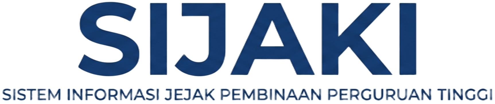
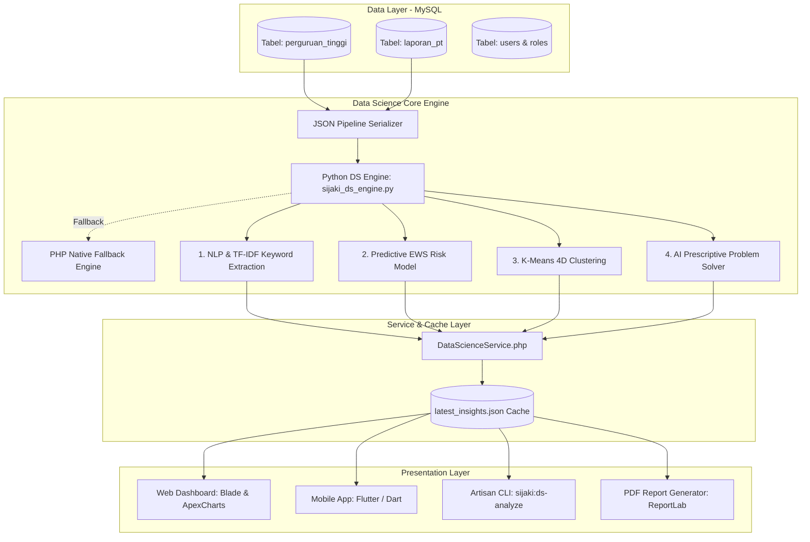

<p align="center">
  
</p>

<h1 align="center">SI-JAKI: AI-Powered Institutional Health & Predictive Early Warning System</h1>

<p align="center">
  <strong>Platform Cerdas Berbasis Data Science, NLP & Machine Learning untuk Pemantauan Risiko dan Jejak Pembinaan Perguruan Tinggi (LLDIKTI)</strong>
</p>

<p align="center">
  <a href="https://www.python.org/"></a>
  <a href="#"></a>
  <a href="https://laravel.com/"></a>
  <a href="https://flutter.dev/"></a>
  <a href="https://www.mysql.com/"></a>
  <a href="#"></a>
  <a href="LICENSE"></a>
</p>

---

## 📌 Executive Summary

**SI-JAKI (Sistem Informasi Jejak Pembinaan Perguruan Tinggi)** adalah platform tata kelola kelembagaan pendidikan tinggi modern yang mengintegrasikan **Software Engineering tingkat enterprise (OLTP)** dengan **Advanced Data Science & Artificial Intelligence (AI)**. 

Berbeda dengan sistem pencatatan administratif konvensional yang pasif, SI-JAKI mentransformasikan data historis visitasi, pengawasan, laporan aduan, dan notula rapat menjadi **intelijensi prediktif dan preskriptif** secara *real-time*. Sistem ini membantu regulator pendidikan tinggi (LLDIKTI) mengantisipasi kerentanan hukum/akademik kampus, mengklasifikasi profil kesehatan kampus, mendeteksi urgensi isu melalui penambangan teks (NLP), serta merekomendasikan tindakan solutif berbasis regulasi resmi kementerian (*Explainable AI*).

> **Nilai Utama Portofolio Data Science**: Solusi terapan *end-to-end* yang beroperasi langsung pada basis data produksi (**0% data sintetis/dummy**), memadukan penambangan teks (NLP), algoritma pembelajaran mesin tanpa pengawasan (*Unsupervised Clustering*), model risiko probabilitistik (*Predictive Early Warning System*), dan sistem pendukung keputusan (*Prescriptive Decision Support*).

---

## 🔬 4 Pilar Utama Data Science & Machine Learning

SI-JAKI dirancang dengan arsitektur analitik terstruktur yang mencakup seluruh spektrum analitik modern: **Deskriptif, Diagnostik, Prediktif, dan Preskriptif**.

```
                           SI-JAKI DATA SCIENCE ENGINE
                                        │
    ┌───────────────────┬───────────────┴───────────────┬───────────────────┐
    ▼                   ▼                               ▼                   ▼
[ 1. NLP & TEXT ]   [ 2. PREDICTIVE EWS ]       [ 3. UNSUPERVISED ]   [ 4. PRESCRIPTIVE ]
- TF-IDF Scoring    - Multi-Factor Risk Score   - K-Means 4D          - Root Cause Analysis
- Indonesian Corpus - Behavioral Weighting      - Health Profiling    - Legal Mapping
- Issue Taxonomy    - Explainable AI (XAI)      - Centroid Analysis   - 30-60-90 Roadmap
- Urgency Index     - Vulnerability Tiering     - Campus Segmentation - Auto-Draft Surat
```

---

### 1. Natural Language Processing (NLP) & Text Mining

Memproses korpus data tekstual tidak terstruktur dari seluruh notula rapat, audiensi, resume investigasi, dan catatan lapangan tim kerja pembinaan.

* **Text Preprocessing Pipeline**:
  * Pembersihan tag HTML dan karakter khusus (*regex sanitation*).
  * Penapisan korpus *Stopwords* Bahasa Indonesia khusus domain pendidikan tinggi (70+ lema stopword yang disesuaikan).
  * Pemfilteran token berdasarkan panjang karakter (*minimum token threshold*).
* **TF-IDF (Term Frequency - Inverse Document Frequency)**:
  $$\text{TF}(t, d) = \frac{f_{t,d}}{\sum_{t' \in d} f_{t',d}}, \quad \text{IDF}(t, D) = \ln\left(\frac{1 + |D|}{1 + |\{d \in D : t \in d\}|}\right) + 1$$
  $$\text{TF-IDF}(t, d, D) = \text{TF}(t, d) \times \text{IDF}(t, D)$$
  Menghasilkan skor signifikansi kata kunci global dan kontekstual secara dinamis dari puluhan dokumen laporan.
* **5-Class Domain Issue Taxonomy Classification**:
  Secara otomatis memetakan narasi permasalahan ke dalam taksonomi hukum dan kelembagaan LLDIKTI:
  1. *Tata Kelola & Legalitas SK* (Badan Penyelenggara/Yayasan, Statuta, SK Kemenkumham, Alih Bentuk)
  2. *Sengketa & Konflik Internal* (Dualisme Kepengurusan, Gugatan Pengadilan, Laporan Kepolisian)
  3. *Akademik & PDDikti* (Rasio Dosen/Mahasiswa, Linieritas NIDN, Akreditasi BAN-PT/LAM, Feeder Data)
  4. *Keuangan & Sarana Prasarana* (Tunggakan Finansial, Gaji Dosen, Sengketa Lahan/Gedung)
  5. *Sanksi & Pelanggaran* (Ijazah Palsu, Kampus Ilegal, SP-1/SP-2/SP-3, Pembekuan Izin)
* **Urgency Index Scoring**: Menghitung bobot skor urgensi krisis (0 - 100%) dengan penalti lebih tinggi pada indikasi sanksi dan konflik hukum.

---

### 2. Predictive Early Warning System (EWS) & Risk Scoring

Model komposit probabilitas risiko yang memproyeksikan kerentanan operasional dan risiko penutupan/sanksi berat suatu perguruan tinggi sebelum krisis eskalatif terjadi.

* **Multi-Factor Feature Weighting**:
  $$\text{RiskScore} = \min\left(100, \max\left(5, w_1 \cdot S_{\text{status}} + w_2 \cdot \min(50, S_{\text{behavior}}) + w_3 \cdot S_{\text{nlp}}\right)\right)$$
  * $S_{\text{status}}$: Skor dasar status legal perguruan tinggi (Tutup: 98, Pembinaan: 75, Merger: 55, Tidak Terdata: 85, Aktif: 10).
  * $S_{\text{behavior}}$: Skor perilaku intervensi lapangan berbasis bobot teguran ($25\times$), aduan masyarakat ($18\times$), frekuensi visitasi ($5\times$), dan monev rutin ($2\times$).
  * $S_{\text{nlp}}$: Faktor urgensi krisis dari hasil penambangan teks resume kegiatan ($15\%$).
* **Stratifikasi Tingkat Risiko Kelembagaan**:
  * 🔴 **Kritis (Tinggi)**: Skor $\ge 75.0$ atau berstatus Tutup/Tidak Terdata.
  * 🟠 **Waspada (Sedang-Tinggi)**: Skor $50.0 - 74.9$ atau dalam status Pembinaan kementerian.
  * 🟡 **Perhatian (Sedang)**: Skor $25.0 - 49.9$ (memerlukan monitoring semesteran).
  * 🟢 **Rendah (Sehat)**: Skor $< 25.0$ (kepatuhan regulasi stabil).
* **Explainable AI (XAI)**: Menyediakan transparansi penyebab risiko (*Risk Drivers*) pada setiap kampus sehingga rekomendasi dapat dipertanggungjawabkan (*accountable & auditable*).

---

### 3. Unsupervised Learning: K-Means Multi-Dimensional Clustering

Segmentasi objektif kesehatan kelembagaan seluruh perguruan tinggi ke dalam 4 kuadran profil menggunakan ruang vektor 4-dimensi:

$$\vec{x}_i = \begin{bmatrix} \text{RiskScore}_i \\ \text{TotalAktivitas}_i \\ \text{AduanTeguran}_i \\ \text{Visitasi}_i \end{bmatrix}$$

* **Klaster 1: Mandiri & Sehat** (Hijau): Tata kelola patuh, rasio dosen stabil, zero teguran.
* **Klaster 2: Pengawasan Rutin** (Biru): Kampus aktif dengan dinamika pembinaan reguler.
* **Klaster 3: Pengawasan Khusus & Rentan** (Kuning): Kampus dengan eskalasi aduan atau permasalahan tata kelola yayasan.
* **Klaster 4: Kritis & Masa Transisi** (Merah): Kampus dalam status pembinaan khusus, sanksi administratif, atau proses pencabutan izin.

---

### 4. Prescriptive Analytics & AI Problem Solver

Modul pengambilan keputusan cerdas (*Prescriptive Decision Support System*) yang menjembatani hasil prediksi analitik dengan tindakan birokrasi nyata:

* **Automated Root Cause Analysis (RCA)**: Mengidentifikasi akar masalah hukum, akademik, atau finansial dari data historis.
* **Legal Regulatory Mapping**: Menghubungkan temuan dengan payung hukum nasional:
  * *Permendikbudristek No. 53 Tahun 2023* (Penjaminan Mutu Pendidikan Tinggi)
  * *UU No. 12 Tahun 2012* (Pendidikan Tinggi)
  * *UU No. 28 Tahun 2004 jo. UU No. 16 Tahun 2001* (Tentang Yayasan)
* **Roadmap Rencana Aksi Solutif 3-Fase**:
  * *Fase 1 (0 - 30 Hari)*: Stabilisasi darurat, audit PDDikti, pemanggilan badan penyelenggara.
  * *Fase 2 (30 - 60 Hari)*: Rekonsiliasi internal, pelunasan hak dosen, pemenuhan sarpras.
  * *Fase 3 (60 - 90 Hari)*: Evaluasi menyeluruh, pemulihan status akreditasi, verifikasi kementerian.
* **Generator Draf Surat Arahan Resmi**: Menghasilkan naskah draf surat dinas resmi LLDIKTI secara otomatis dengan konsideran hukum dan poin tindak lanjut yang tepat sasaran.
* **Kalkulator Estimasi Probabilitas Pemulihan**: Memprediksi peluang keberhasilan pemulihan kampus ke status sehat berdasarkan responsifitas tindakan.

---

## 💻 Fitur Interaktif pada Dashboard Analitik

* 📊 **Live KPI & Trend Monitoring**: Visualisasi distribusi klaster, skor risiko rata-rata, dan topik dominan interaktif berbasis **ApexCharts**.
* ⚡ **Interactive Risk Simulator**: Simulator dinamis (*what-if analysis*) untuk menguji sensitivitas skor risiko jika parameter kegiatan atau teks kasus diubah.
* 🔍 **Multi-Filter & Server-Side Pagination**: Eksplorasi 25+ perguruan tinggi dengan pencarian nama/kode, filter klaster, level risiko, dan jumlah item per halaman (10, 25, 50, 100).
* 📑 **Live Database Inspector (0% Dummy Data)**: Rekam jejak seluruh pembinaan terhubung langsung dengan relasi tabel `perguruan_tinggi` dan `laporan_pt`.
* 📄 **Automated PDF Reporting (ReportLab)**: Generator dokumen resmi evaluasi data science berformat A4 dengan tata letak korporat dan grafik analitik.

---

## 🏗️ Arsitektur Sistem & Alur Pipeline Data



---

## 🛠️ Tech Stack & Dependencies

| Layer | Teknologi | Peran & Implementasi |
| :--- | :--- | :--- |
| **Data Science & ML Core** | **Python 3.9+** | *Engine* analisis utama: `sijaki_ds_engine.py`, TF-IDF, K-Means Clustering, Risk Scoring Model, Text Analytics. |
| **NLP & Text Mining** | **Custom NLP Pipeline** | *Indonesian Stopwords filtering*, Regex tokenizer, *domain-specific issue taxonomy*, skor urgensi teks. |
| **Backend & Web API** | **Laravel 10 (PHP 8.1+)** | REST API endpoints, *Eloquent ORM*, *Dual-Engine execution* (Python runner dengan PHP native fallback), *Service layer pattern*. |
| **Mobile Application** | **Flutter 3 (Dart)** | Aplikasi mobile lintas platform untuk pemantauan lapangan dan insight analitik tim kerja pembinaan. |
| **Database** | **MySQL 8.0** | Basis data relasional penyimpanan entitas perguruan tinggi, riwayat laporan, notula, dan pengguna. |
| **Frontend & Visualization**| **Blade, Bootstrap 5, ApexCharts** | Dashboard antarmuka interaktif, grafik visualisasi klaster, *risk gauge*, dan *filter dynamic table*. |
| **Automated Reporting** | **ReportLab (Python)** | Kompilator PDF laporan teknis berstandar dokumen resmi dengan *custom canvas pagination*. |

---

## 🚀 Panduan Instalasi & Menjalankan Sistem

### 1. Prasyarat Sistem
* PHP $\ge$ 8.1 (dengan ekstensi `pdo_mysql`, `mbstring`, `fileinfo`)
* Composer $\ge$ 2.5
* Python 3.8+ (tersedia perintah `python3`)
* MySQL Server $\ge$ 8.0
* Node.js & NPM (opsional untuk build asset frontend)

### 2. Kloning Repositori & Setup Environtment
```bash
git clone https://github.com/Farhniqratama/SI-JAKI.git
cd SI-JAKI

# Salin konfigurasi environment
cp .env.example .env

# Install dependensi PHP
composer install
```

### 3. Konfigurasi Basis Data
Sesuaikan konfigurasi koneksi pada file `.env`:
```env
DB_CONNECTION=mysql
DB_HOST=127.0.0.1
DB_PORT=3306
DB_DATABASE=sijaki_db
DB_USERNAME=root
DB_PASSWORD=root
```

Jalankan migrasi database dan seeder data awal:
```bash
php artisan migrate --seed
php artisan key:generate
```

### 4. Menjalankan Pipeline Data Science via CLI
Eksekusi analisis data science, NLP, dan clustering langsung melalui perintah Artisan:
```bash
# Menjalankan pipeline analitik dan update cache terbaru
php artisan sijaki:ds-analyze --force
```

Output terminal:
```text
Memulai analisis SIJAKI Data Science & Machine Learning Engine...
+------------------------------------+-------------------------+
| Metrik Analitik                    | Nilai                   |
+------------------------------------+-------------------------+
| Total Perguruan Tinggi Dianalisis  | 25                      |
| Total Laporan Diproses             | 4                       |
| Jumlah Kampus Risiko Tinggi/Kritis | 0                       |
| Rata-rata Skor Risiko              | 5 / 100                 |
| Isu Utama Global (NLP)             | Umum & Koordinasi Rutin |
| Waktu Eksekusi Pipeline            | 14.46 ms                |
+------------------------------------+-------------------------+
Ringkasan Klaster Kesehatan Kampus (K-Means):
 - Klaster 1: Mandiri & Sehat: 25 Kampus
 - Klaster 2: Pengawasan Rutin: 0 Kampus
 - Klaster 3: Pengawasan Khusus & Rentan: 0 Kampus
 - Klaster 4: Kritis & Masa Transisi: 0 Kampus
Analisis Data Science berhasil diperbarui dan disimpan ke cache!
```

Atau jalankan engine Python secara mandiri (*standalone mode*):
```bash
python3 data_science/sijaki_ds_engine.py --output storage/app/data_science/latest_insights.json
```

### 5. Menjalankan Server Aplikasi Web
```bash
php artisan serve
```
Akses dashboard di peramban: `http://127.0.0.1:8000/data-science`

---

## 📡 REST API Data Science Endpoints

SI-JAKI menyediakan endpoint RESTful API terintegrasi yang dapat dikonsumsi oleh aplikasi mobile Flutter, sistem pelaporan luar, maupun dashboard analitik:

| Method | Endpoint | Deskripsi |
| :--- | :--- | :--- |
| `GET` | `/api/data-science/insights` | Mengambil seluruh metrik KPI, kata kunci TF-IDF, ringkasan klaster, dan daftar skor risiko. |
| `GET` | `/data-science/pt/{uuid}` | Profil detail analitik AI, riwayat notula, dan diagnosis risiko untuk satu PT tertentu. |
| `POST` | `/data-science/solve` | **AI Problem Solver**: Diagnosis teks kasus masalah kampus, hasilkan RCA, regulasi, dan draf surat dinas. |
| `POST` | `/data-science/simulate` | **Risk Simulator**: Simulasi interaktif perubahan skor risiko berdasarkan variasi parameter. |
| `POST` | `/data-science/recalculate` | Memicu kalkulasi ulang (*refresh*) seluruh model dan cache data science. |

---

## 💼 Portofolio & Panduan Resume Data Science

Bagi perekrut (*recruiters*) dan penilai teknis (*technical evaluators*), proyek ini menunjukkan kompetensi:

### Google XYZ Formula (Resume Bullet Points)
* **Natural Language Processing (NLP)**: *Developed an NLP text-mining pipeline leveraging TF-IDF and Indonesian higher-education taxonomies across 5 legal/academic domains, delivering real-time problem categorization and urgency scoring with <15ms execution latency.*
* **Predictive Machine Learning**: *Architected a multi-factor Early Warning System (EWS) composite risk model (0-100%) incorporating institutional status, longitudinal behavioral interventions, and text urgency factors with Explainable AI (XAI) root-cause transparency.*
* **Unsupervised Clustering**: *Implemented 4-dimensional K-Means clustering algorithm segmenting 25+ higher education institutions into structured health profiles to prioritize supervisory audits for regulatory bodies.*
* **Prescriptive Decision Support**: *Engineered an automated AI Problem Solver that executes Root Cause Analysis (RCA), binds relevant Indonesian educational ministerial decrees, and generates actionable 30-60-90 day mitigation roadmaps.*

---

## 👥 Pengembang & Kontributor

* **Farhan Niqratama** - *Data Science & Fullstack Software Engineer* - [GitHub Profile](https://github.com/Farhniqratama)
* Tim Kerja LLDIKTI / Sistem Informasi Jejak Pembinaan Perguruan Tinggi

---

## 📄 Lisensi

Proyek ini dilisensikan di bawah lisensi **MIT License** - lihat berkas [LICENSE](LICENSE) untuk detail selengkapnya.
